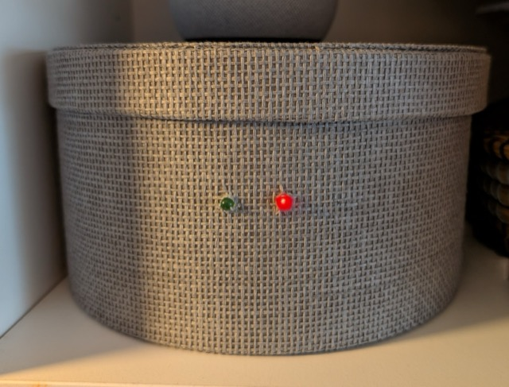
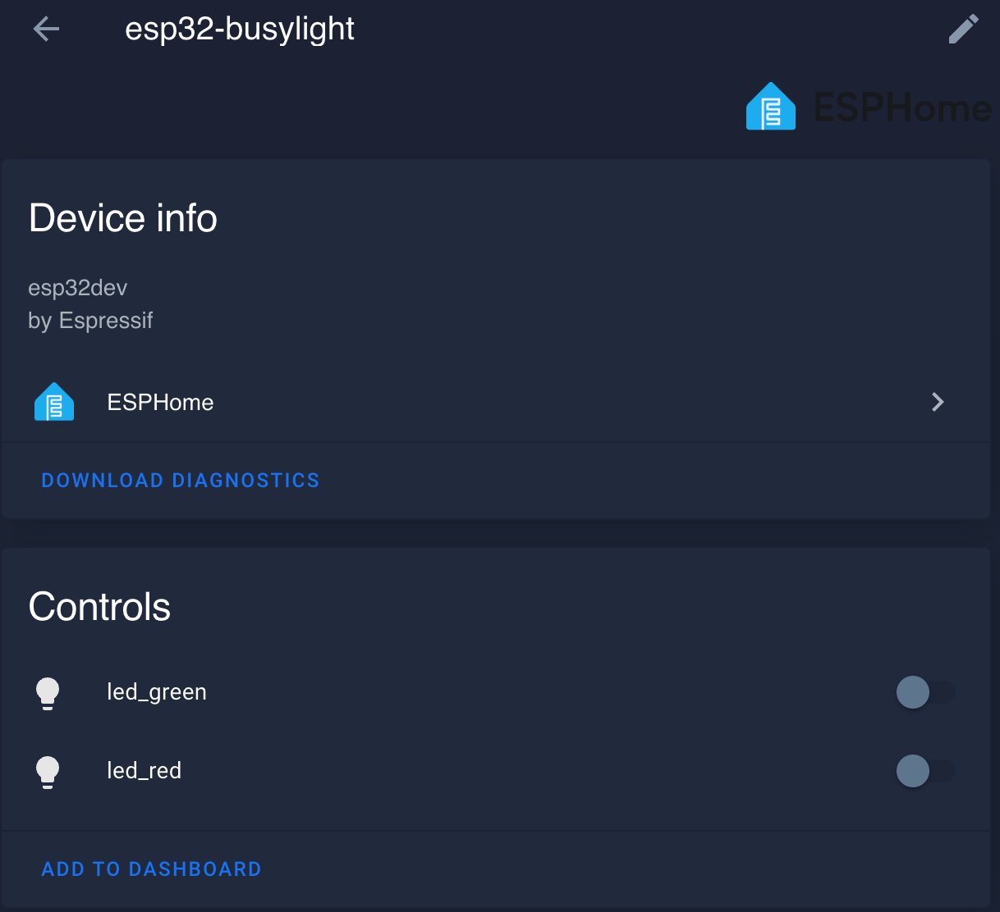
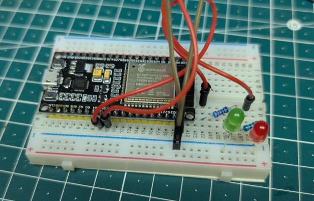
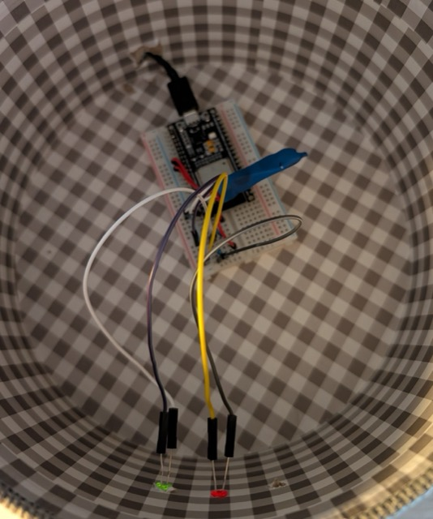

##  DIY Busylight for MS Teams on MacOS

Technologies used:

- [HomeAssistant](https://www.home-assistant.io/) to detect the status (in a call or not) and run automations based on that
  - HA Companion App for MacOS
- [esp32](https://www.espressif.com/en/products/socs/esp32) to control some simple LEDs
  - esphome for the flashing process
- MS Teams Client for MacOS - *this approach uses only local sensors to determine the call status. It does not connect to the Teams API*.

### Software
**HomeAssistant App**

`brew install homea-assistant` or via [App Store](https://apps.apple.com/us/app/home-assistant/id1099568401)

Connect to your instance, you should see a bunch of new sensors for your Mac. We need the two sensors `binary_sensor.<macbook>_camera_in_use` and `binary_sensor.<macbook>_audio_input_in_use` for our automations.

**esphome**

`brew install esphome`

Open Dashboard: `esphome dashboard configuration/`

Edit the `esp32-busylight.yaml` and flash the device with it. You should see a new device in your HA with two entities (led_green & led_red).

### HomeAssistant Automations
- Create a helper in HA (Settings > Devices & services > Helpers) `input_boolean.homeoffice_dnd`
- Create the two automations from `ha-automations.yaml` in your HA (add your own sensor name).

### Hardware
Take your esp32 and grab some jumper wires, two LEDs and a breadboard. See [this article](https://esp32io.com/tutorials/esp32-blink-multiple-led) for wiring details.

When everything is running, place your hardware in a box like this:

